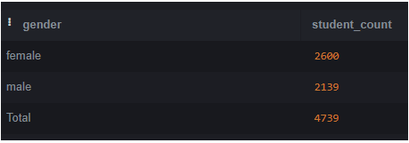
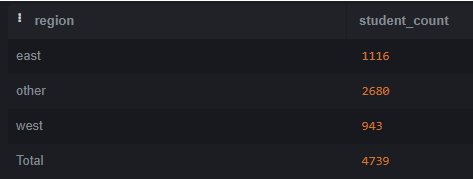
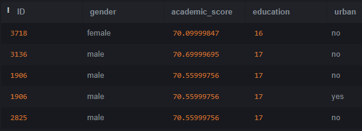
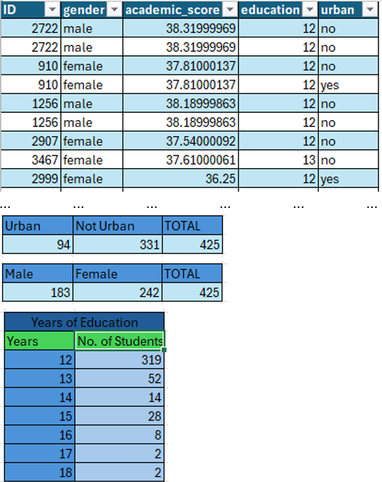

# Student Academic Performance Analysis by Demographic Factors


###### Image by artursafronovvvv on https://www.freepik.com
---

## Table of Contents
- [Project Overview](#project-overview)
- [Tools](#tools)
- [Data Design](#data-design)
- [Exploratory Data Analysis](#exploratory-data-analysis)
- [Data Analysis](#data-analysis)
- [Findings](#findings)
- [Conclusion](#conclusion)  

## Project Overview
This project involves a comprehensive analysis of student academic performance, with a focus on understanding how various demographic factors influence academic outcomes. The study aims to evaluate whether students' academic performance is affected by their gender, years of education, urban or rural residence, region, ethnicity, country unemployment rate in 2020, and parental educational background. 
Data were analyzed using SQL and Microsoft Excel. Four datasets were imported into SQLite and merged into a single table, using the JOIN function. This unified dataset was then utilized to create additional tables for detailed analysis.

## Tools
- Microsoft Excel
- SQL

## Data Design

The dataset includes information on 4,739 students, with 2,600 identified as female and 2,139 as male. Data were collected from four sources:
1. **Student Personal Details**: Includes fields for ID, gender, date of birth, ethnicity, academic info ID, county ID, and family details ID.
2. **Student Family Details**: Contains ID, father's college education (fcollege), mother's college education (mcollege), home ownership status (home), urban/rural residence (urban), and income.
3. **Student Academic Info**: Includes ID, academic score, student tuition, and education level.
4. **County Info**: Features ID, unemployment rate (unemp), average wage (wage), distance to the region, and average county tuition.

### **Definitions of Column Names**:

-	**Gender**: Factor indicating the student's gender.
-	**Ethnicity**: Factor indicating the student's ethnicity (African-American, Hispanic, Asian, or Other).
-	**Academic Score**: The student’s overall academic performance throughout high school and college.
-	**Student Tuition**: The cost of tuition for the student.
-	**Education**: The number of years of education the student has received.
-	**Fcollege**: Factor indicating if the father is a college graduate.
-	**Mcollege**: Factor indicating if the mother is a college graduate.
-	**Home**: Factor indicating if the family owns their own home.
-	**Urban**: Factor indicating if the school is located in an urban area.
-	**Unemp**: Country’s unemployment rate in 2020.
-	**Income**: Household income level categorized as high or low based on country averages.
-	**Region**: Factor indicating the student’s region (West, East, or Other).

## Exploratory Data Analysis

### **Key Insights**:

1.	**Total Number of Students by Gender**: Determine the distribution of students based on gender.
2.	**Student Distribution by Region**: Analyze the number of students in each region.
3.	**Students with Academic Scores ≥ 70**: Identify how many students have academic scores of 70 or higher.
4.	**Students with Academic Scores ≤ 39**: Identify how many students have academic scores of 39 or lower.
5.	**Top 100 Students by Academic Scores**: List the top 100 students with the highest academic scores.
6.	**Bottom 100 Students by Academic Scores**: List the bottom 100 students with the lowest academic scores.

## Data Analysis

**To begin the analysis, I joined the four datasets—Student Personal Details, Student Family Details, Student Academic Info, and County Info—using SQLite. The following query was used to combine these datasets:**

```sql
select*
from student_personal_details
join student_family_details
on student_personal_details.ID = student_family_details.id
join student_academic_info
on student_family_details.id = student_academic_info.id
join county_info
on student_academic_info.id = county_info.id;
```

**Total number of students by gender**

```sql
SELECT gender, COUNT(gender) AS student_count
FROM student_personal_details
Group by gender

UNION ALL

SELECT 'Total' AS gender, COUNT(gender) AS student_count
FROM student_personal_details;
```



**Total number of students by region**

```sql
SELECT region, COUNT(id) AS student_count
FROM county_info
GROUP BY region

UNION ALL

SELECT 'Total' AS region, COUNT(id) AS student_count
FROM county_info;
```



**Students with academic scores greater and equal to 70**

```sql
select student_personal_details.ID, student_personal_details.gender, student_academic_info.academic_score, student_academic_info.education, student_family_details.urban     
FROM student_personal_details
JOIN student_family_details
ON student_personal_details.ID = student_family_details.id
JOIN student_academic_info
ON student_family_details.id = student_academic_info.id
where academic_score >= 70;
```



**Students with academic scores less and equal to 39**

```sql
select student_personal_details.ID, student_personal_details.gender, student_academic_info.academic_score, student_academic_info.education, student_family_details.urban     
FROM student_personal_details
JOIN student_family_details
ON student_personal_details.ID = student_family_details.id
JOIN student_academic_info
ON student_family_details.id = student_academic_info.id
where academic_score <= 39;
```




**Top 100 Students by Academic Scores**

```sql
select student_personal_details.ID,student_personal_details.gender, student_academic_info.academic_score, county_info.unemp, county_info.region, student_family_details.urban, student_personal_details.ethnicity
from student_personal_details
join student_family_details
on student_personal_details.ID = student_family_details.id
join student_academic_info
on student_family_details.id = student_academic_info.id
join county_info
on student_academic_info.id = county_info.id
ORDER BY academic_score DESC
LIMIT 100;
```

**Bottom 100 Students by Academic Scores**

```sql
select student_personal_details.ID,student_personal_details.gender, student_academic_info.academic_score, county_info.unemp, county_info.region, student_family_details.urban, student_personal_details.ethnicity
from student_personal_details
join student_family_details
on student_personal_details.ID = student_family_details.id
join student_academic_info
on student_family_details.id = student_academic_info.id
join county_info
on student_academic_info.id = county_info.id
ORDER BY academic_score asc
LIMIT 100;
```

## Findings

- **Distinctions (70% and Above)**: A total of 5 students achieved distinctions. Among these, 1 student was from an urban area, while 4 were from rural areas. This indicates that a higher proportion of students from rural areas achieved distinctions compared to those from urban areas.
- **Gender and Distinctions**: Out of the students with distinctions, 4 were male and 1 was female. This suggests a gender disparity in high academic performance. Given that there are more female students overall, efforts should be made to encourage and support female students to improve their academic performance.
- **Failures (39% and Below)**: A total of 425 students failed. Of these, 183 were male and 242 were female. Additionally, 94 students were from urban areas and 331 from rural areas. This indicates that a higher proportion of students who failed were from rural areas, suggesting that the location of the school may influence academic performance.
- **Impact of Education Duration**: The number of years of education received significantly impacted academic performance, with longer education correlating with better performance.

## Conclusion

The analysis of student academic performance through the lens of demographic factors has provided valuable insights into how gender, socio-economic status, and geographic location influence academic outcomes. The findings highlight notable disparities and underscore the need for targeted interventions to address these differences. By incorporating demographic considerations into educational assessments, we can better identify and address educational inequities, ultimately fostering a more inclusive and supportive learning environment. These insights are crucial for developing strategies that enhance academic performance and promote fairness in educational opportunities.

